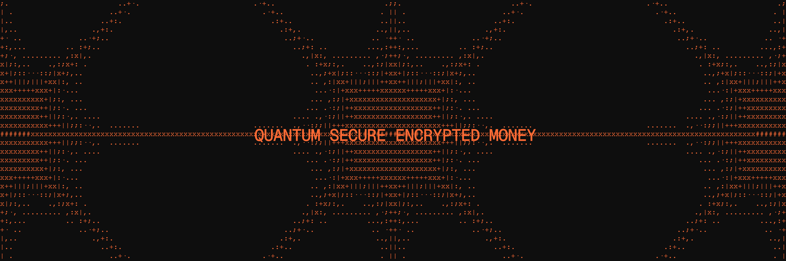

# Quantus Network Node Installation Guide

This guide will help you install and run a Quantus Network node for mining.

**🚀 Quick Start Mining**: See our [Mining Guide](MINING.md) for a comprehensive setup tutorial with troubleshooting and optimization tips.

## Prerequisites

Use Rust nightly version from December 2024 or newer. The stable channel will not work.

```sh
curl --proto '=https' --tlsv1.2 -sSf https://sh.rustup.rs | sh
rustup toolchain install nightly
rustup default nightly
```

Verify your installation:

```sh
cargo --version
# Expected output: cargo 1.85.0-nightly (769f622e1 2024-12-14) or newer
```

## Build

Use the following command to build the node:

```sh
cargo build --release
```

The compiled binary will be available at `./target/release/quantus-node`.

## Key Management

### Generate a New Key

```sh
./target/release/quantus-node key quantus
```

This creates a new 24-word phrase, seed, and public and private keys.

### Restore Key from Seed Phrase

```sh
./target/release/quantus-node key quantus --words
```

You will be prompted for the phrase (input is not echoed). Non-interactively, pipe it in: `./target/release/quantus-node key quantus --words < mnemonic.txt`.

Words should be a 24-word list separated by spaces, like "autumn bear...". The words must be from the BIP39 wordlist.

### Restore Key from Seed

```sh
./target/release/quantus-node key quantus --seed
```

You will be prompted for the seed (input is not echoed). Non-interactively, pipe it in: `./target/release/quantus-node key quantus --seed < seed.txt`.

Seed must be a 128-character hexadecimal string (64 bytes).

> Secrets are deliberately read from stdin rather than accepted as command-line arguments: argv is world-readable via `/proc/<pid>/cmdline`, recorded in shell history, and commonly captured by audit and orchestration logs.

## Mining

For complete mining setup instructions, including wormhole address requirements and external miner configuration, see [MINING.md](MINING.md).

## Development

### Local Development Node

Start a single-node development chain (state is not persisted):

```sh
./target/release/quantus-node --dev
```

To purge the development chain's state:

```sh
./target/release/quantus-node purge-chain --dev
```

To start with detailed logging:

```sh
RUST_BACKTRACE=1 ./target/release/quantus-node -ldebug --dev
```

#### Development Chain Features

- Maintains state in a `tmp` folder while the node is running
- Uses the **Alice** and **Bob** accounts as default validator authorities
- Governance is bootstrapped via the tech collective (no sudo pallet)
- Preconfigured with a genesis state (`/node/src/chain_spec.rs`) that includes several pre-funded development accounts

#### Persisting Chain State

To persist chain state between runs, specify a base path:

```sh
# Create a folder to use as the db base path
mkdir my-chain-state

# Use that folder to store the chain state
./target/release/quantus-node --dev --base-path ./my-chain-state/

# Check the folder structure created inside the base path after running the chain
ls ./my-chain-state
# chains
ls ./my-chain-state/chains/
# dev
ls ./my-chain-state/chains/dev
# db keystore network
```

### Multi-Node Local Testnet

To run a local testnet with multiple validator nodes, use the provided script:

```sh
# From workspace root
./scripts/run_local_nodes.sh
```

This script handles building the node and launching two validator nodes and a listener node connected to each other. Refer to the script comments for configuration details.

If you want to see the multi-node consensus algorithm in action, see [Simulate a network](https://docs.substrate.io/tutorials/build-a-blockchain/simulate-network/).

### Linting

We use `taplo` for formatting TOML files and nightly `rustfmt` for Rust code. The rustfmt nightly is pinned in
`rustfmt-toolchain`; `scripts/fmt.sh` installs it on first use and forwards its arguments to `cargo fmt`.

```sh
taplo format --config taplo.toml
scripts/fmt.sh --all -- --check
```

## Database Storage Configuration

This chain has mandatory storage configuration settings that cannot be overridden by command-line parameters:

**Blocks Pruning:** KeepFinalized

**State Pruning:** ArchiveCanonical

### What This Means

**ArchiveCanonical State Pruning:** The node will keep the state for all blocks that are part of the canonical chain. This ensures you can query historical state for any finalized block, while non-canonical blocks' states are pruned to save disk space.

**KeepFinalized Blocks Pruning:** The node will keep all finalized blocks and prune non-finalized blocks that become stale.

### Command-Line Parameters

Note that any command-line parameters related to pruning (`--state-pruning`, `--blocks-pruning`) will be ignored as these settings are enforced at the code level for all node operators.

### Disk Usage

This configuration provides a good balance between storage efficiency and data availability. You should expect your database to grow steadily over time as the blockchain progresses, though at a slower rate than a full archive node. If you're running a validator or service that needs access to historical chain state, this configuration will meet your needs while optimizing disk usage.

## Connect with Polkadot-JS Apps Front-End

After you start the node locally, you can interact with it using the hosted version of the [Polkadot/Substrate Portal](https://polkadot.js.org/apps/#/explorer?rpc=ws://localhost:9944) front-end by connecting to the local node endpoint. A hosted version is also available on [IPFS](https://dotapps.io/). You can also find the source code and instructions for hosting your own instance in the [`polkadot-js/apps`](https://github.com/polkadot-js/apps) repository.

## Embedded Documentation

After you build the project, you can use the following command to explore its parameters and subcommands:

```sh
./target/release/quantus-node -h
```

You can generate and view the [Rust Docs](https://doc.rust-lang.org/cargo/commands/cargo-doc.html) for this project with this command:

```sh
cargo +nightly doc --open
```

## Architecture

### Template Structure

A Substrate project such as this consists of a number of components that are spread across a few directories.

### Node

A blockchain node is an application that allows users to participate in a blockchain network. Substrate-based blockchain nodes expose a number of capabilities:

- **Networking:** Substrate nodes use the [`libp2p`](https://libp2p.io/) networking stack to allow the nodes in the network to communicate with one another.
- **Consensus:** Blockchains must have a way to come to [consensus](https://docs.substrate.io/fundamentals/consensus/) on the state of the network. Substrate makes it possible to supply custom consensus engines and also ships with several consensus mechanisms that have been built on top of [Web3 Foundation research](https://research.web3.foundation/Polkadot/protocols/NPoS).
- **RPC Server:** A remote procedure call (RPC) server is used to interact with Substrate nodes.

There are several files in the `node` directory. Take special note of the following:

- [`chain_spec.rs`](./node/src/chain_spec.rs): A [chain specification](https://docs.substrate.io/build/chain-spec/) is a source code file that defines a Substrate chain's initial (genesis) state. Chain specifications are useful for development and testing, and critical when architecting the launch of a production chain. Take note of the `development_config` and `testnet_genesis` functions. These functions are used to define the genesis state for the local development chain configuration. These functions identify some [well-known accounts](https://docs.substrate.io/reference/command-line-tools/subkey/) and use them to configure the blockchain's initial state.
- [`service.rs`](./node/src/service.rs): This file defines the node implementation. Take note of the libraries that this file imports and the names of the functions it invokes. In particular, there are references to consensus-related topics, such as the [block finalization and forks](https://docs.substrate.io/fundamentals/consensus/#finalization-and-forks) and other [consensus mechanisms](https://docs.substrate.io/fundamentals/consensus/#default-consensus-models) such as Aura for block authoring and GRANDPA for finality.

### Runtime

In Substrate, the terms "runtime" and "state transition function" are analogous. Both terms refer to the core logic of the blockchain that is responsible for validating blocks and executing the state changes they define. The Substrate project in this repository uses [FRAME](https://docs.substrate.io/learn/runtime-development/#frame) to construct a blockchain runtime. FRAME allows runtime developers to declare domain-specific logic in modules called "pallets". At the heart of FRAME is a helpful [macro language](https://docs.substrate.io/reference/frame-macros/) that makes it easy to create pallets and flexibly compose them to create blockchains that can address [a variety of needs](https://substrate.io/ecosystem/projects/).

Review the [FRAME runtime implementation](./runtime/src/lib.rs) included in this template and note the following:

- This file configures several pallets to include in the runtime. Each pallet configuration is defined by a code block that begins with `impl $PALLET_NAME::Config for Runtime`.
- The pallets are composed into a single runtime by way of the [`construct_runtime!`](https://paritytech.github.io/substrate/master/frame_support/macro.construct_runtime.html) macro, which is part of the [core FRAME pallet library](https://docs.substrate.io/reference/frame-pallets/#system-pallets).

### Pallets

The runtime in this project is constructed using many FRAME pallets that ship with [the Substrate repository](https://github.com/paritytech/polkadot-sdk/tree/master/substrate/frame) and a template pallet that is [defined in the `pallets`](./pallets/template/src/lib.rs) directory.

A FRAME pallet is comprised of a number of blockchain primitives, including:

- **Storage:** FRAME defines a rich set of powerful [storage abstractions](https://docs.substrate.io/build/runtime-storage/) that makes it easy to use Substrate's efficient key-value database to manage the evolving state of a blockchain.
- **Dispatchables:** FRAME pallets define special types of functions that can be invoked (dispatched) from outside of the runtime in order to update its state.
- **Events:** Substrate uses [events](https://docs.substrate.io/build/events-and-errors/) to notify users of significant state changes.
- **Errors:** When a dispatchable fails, it returns an error.

Each pallet has its own `Config` trait which serves as a configuration interface to generically define the types and parameters it depends on.

## Alternative Installations

Instead of installing dependencies and building this source directly, consider the following alternatives.

### Nix

Install [nix](https://nixos.org/) and [nix-direnv](https://github.com/nix-community/nix-direnv) for a fully plug-and-play experience for setting up the development environment. To get all the correct dependencies, activate direnv:

```sh
direnv allow
```

### Docker

Please follow the [Substrate Docker instructions here](https://github.com/paritytech/polkadot-sdk/blob/master/substrate/docker/README.md) to build the Docker container with the Substrate Node Template binary.

### try-runtime

Compile the node with the `try-runtime` feature enabled to use the runtime wasm for `try-runtime` [check](https://github.com/paritytech/try-runtime-cli):

```sh
cargo build --release --features try-runtime

try-runtime --runtime target/release/wbuild/quantus-runtime/quantus_runtime.wasm on-runtime-upgrade --disable-spec-version-check --blocktime 10000 live --uri <WS_URL>
```

## Resources

### DeepWiki

Got a technical question about the codebase? Feel free to ask it on our DeepWiki page: 

[](https://deepwiki.com/Quantus-Network/chain)